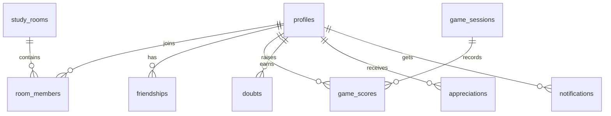

<p align="center">
  
  
  
  
  
</p>

# 📚 BondBox

**A collaborative virtual study room where friends learn together, compete in mini-games, and build meaningful connections.**

BondBox transforms solo studying into a shared experience — create real-time study rooms with video & voice, challenge friends to quiz battles, track your progress, and grow together.

🌐 **Live Demo:** [bond-box.vercel.app](https://bond-box.vercel.app/)  
📦 **Repository:** [github.com/suryatejabatchu08/BondBox](https://github.com/suryatejabatchu08/BondBox)

---

## ✨ Features

### 🏠 Study Rooms
- Create rooms with customizable types: **Silent**, **Doubt Solving**, **Group Revision**, **Exam Night**
- Real-time **video & voice calls** via WebRTC (peer-to-peer)
- **Screen sharing** with Google Meet-inspired spotlight layout
- Built-in **Pomodoro timer** with configurable work/break durations
- Shared **collaborative canvas** for whiteboard sessions
- Live **typing indicators** and **presence tracking**

### 🎮 Mini Games
- **Quiz Battle** — Compete in timed subject quizzes, earn XP and coins
- **Math Duel** — Fast-paced math challenges with real-time scoring
- Matchmaking system with game sessions

### 👥 Social
- **Friends system** — Send/accept friend requests, view online status
- **Appreciation wall** — Send stickers and kind messages to friends
- **Mood tracking** — Set and share your current mood with the group
- **Leaderboard** — Compete for top ranks by XP, teaching XP, or coins

### 📊 Activity & History
- **XP History** — Full timeline of earned XP & coins from battles, doubts, and appreciations
- **Room History** — Browse past study sessions grouped by date with duration tracking
- **Notifications** — Real-time alerts for friend requests, room invites, game invites, and more

### 🎨 Design
- Dark minimal aesthetic inspired by Linear & Vercel
- Animated **pixel snow** background effect
- Glassmorphism cards and subtle micro-animations
- Fully responsive layout with collapsible sidebar

---

## 🏗️ Architecture

```
BondBox/
├── src/                          # React frontend
│   ├── components/
│   │   ├── layout/               # AppLayout, Sidebar, NotificationPanel
│   │   ├── study-room/           # VideoGrid, VideoTile, Canvas, Chat
│   │   └── ui/                   # PixelSnow, shared UI components
│   ├── features/
│   │   ├── auth/                 # Login, Signup, Onboarding, AuthProvider
│   │   ├── dashboard/            # Main dashboard with stats & quick actions
│   │   ├── rooms/                # Room list, Room page, Room history
│   │   ├── games/                # Quiz Battle, Math Duel
│   │   ├── friends/              # Friend list & requests
│   │   ├── appreciation/         # Appreciation wall
│   │   ├── leaderboard/          # XP & coin rankings
│   │   ├── activity/             # XP history timeline
│   │   ├── doubts/               # Doubt raising & resolution
│   │   └── mood/                 # Mood check-in modal
│   ├── hooks/                    # useWebRTC, usePresence, useCanvasSync, useTypingIndicator
│   ├── store/                    # Zustand state (auth, app state)
│   ├── lib/                      # Supabase client
│   └── types/                    # TypeScript type definitions
│
├── backend/                      # FastAPI backend
│   ├── main.py                   # FastAPI app, WebSocket endpoints
│   ├── config.py                 # Environment configuration
│   ├── routers/
│   │   ├── rooms.py              # Room CRUD & join/leave APIs
│   │   └── users.py              # User profile & stats APIs
│   └── services/
│       ├── websocket_manager.py  # WebSocket connection management
│       ├── redis_client.py       # Upstash Redis client
│       ├── presence.py           # Online presence tracking
│       ├── leaderboard_cache.py  # Cached leaderboard queries
│       └── rate_limiter.py       # API rate limiting
│
└── supabase/                     # Database migrations & config
```

---

## 🛠️ Tech Stack

| Layer | Technology |
|-------|-----------|
| **Frontend** | React 19, TypeScript, Vite 7 |
| **Styling** | Tailwind CSS 4, Custom CSS design system |
| **State** | Zustand, React Query |
| **Routing** | React Router 7 |
| **Icons** | Lucide React |
| **Backend** | FastAPI, Uvicorn, Python 3 |
| **Database** | Supabase (PostgreSQL) with Row Level Security |
| **Auth** | Supabase Auth (Email/Password + Google OAuth) |
| **Real-time** | WebRTC (peer-to-peer video/voice), WebSockets (signaling, chat, presence) |
| **Caching** | Upstash Redis (leaderboard cache, rate limiting, presence) |

---

## 🚀 Getting Started

### Prerequisites

- **Node.js** 18+
- **Python** 3.11+
- **Supabase** project (free tier works)
- **Upstash Redis** instance (optional, for caching)

### 1. Clone & Install

```bash
git clone https://github.com/suryatejabatchu08/BondBox.git
cd BondBox

# Frontend
npm install

# Backend
cd backend
python -m venv .venv
.venv\Scripts\activate      # Windows
# source .venv/bin/activate  # macOS/Linux
pip install -r requirements.txt
```

### 2. Environment Variables

Create a `.env` file in the project root:

```env
# Supabase
VITE_SUPABASE_URL=https://your-project-id.supabase.co
VITE_SUPABASE_ANON_KEY=your-anon-key

# Backend (in backend/.env or same root .env)
SUPABASE_URL=https://your-project-id.supabase.co
SUPABASE_SERVICE_KEY=your-service-role-key
UPSTASH_REDIS_URL=your-upstash-url
UPSTASH_REDIS_TOKEN=your-upstash-token
```

### 3. Database Setup

Run the Supabase migrations or create tables manually. Key tables:

- `profiles` — User profiles with XP, coins, mood
- `study_rooms` — Room configuration and metadata
- `room_members` — Room membership with join/leave timestamps
- `friendships` — Friend connections and status
- `game_sessions` & `game_scores` — Game matchmaking and results
- `doubts` — Doubt raising and resolution tracking
- `appreciations` — Peer appreciation messages
- `notifications` — In-app notification system

### 4. Run

```bash
# Terminal 1 — Frontend
npm run dev

# Terminal 2 — Backend
cd backend
uvicorn main:app --reload --port 8000
```

Open **http://localhost:5173** in your browser.

---

## 📖 Database Schema



---

## 📝 Scripts

| Command | Description |
|---------|-------------|
| `npm run dev` | Start Vite dev server |
| `npm run build` | Production build |
| `npm run lint` | Run ESLint |
| `npm run preview` | Preview production build |

---

## 📄 License

This project is private and not licensed for redistribution.

---

<p align="center">
  Built with 💙 by <strong>Team Route 301</strong>
</p>
